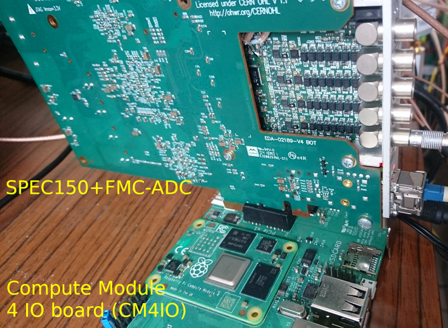

# Installing WRTD for the SPEC150T and FMC ADC

There are a lot lot of software dependencies needed for this project to work.
Here is a graph of most repositories that are used, and their dependencies:


Finding manually the right versions that are compatible with each other is out of question.
Until CERN provides a packaging with links to all the most up-to-date and compatible repositories, will be using the scripts provided by Dimitrios Lampridis to build and install everything:
https://gitlab.cern.ch/dlamprid/ohwr-build-scripts.

## 1. Installing dependencies 

With `apt` for Debian:
```bash
sudo apt install linux-headers-amd64 build-essential gcc git patch sudo curl lua5.1 python3-setuptools python3-yaml python3-decorator libreadline-dev
```
You may need to install `python-is-python3` so Python works properly when running the scripts later.

Note: You will need LUA 5.1 and no other version for one of the tools to work.

---

With `yum` for CentOS (tested June 2023):

You will need CentOS Plus
```bash
sudo yum --enablerepo centosplus install kernel-plus kernel-plus-headers kernel-plus-devel
```
Reboot using CentOS Plus.
```bash
sudo yum install gcc git patch curl python-setuptools python-decorator python-yaml readline-devel
```

For cross-compiling to a target with a different architecture than the host (e.g. Compute Module 4 based ARM processor), refer to the environment variables to be set prior to running the scripts (section 2, Running the scripts), assuming a functional Buildroot is already available on the host, as described in section 5 Intallation on a Raspberry Pi CM4 with Buildroot. Most significantly ``SKIP_INSTALL`` will prevent installing the compilation result on the host.

## 2. Running the scripts

Start by cloning the scripts:
```bash
git clone https://gitlab.cern.ch/dlamprid/ohwr-build-scripts.git
```

You will then need to patch the repository:
```bash
cd ohwr-build-scripts
patch -p 1 < ../ohwr-build-scripts.patch
```

You should set the variable `BUILD_DIR` to a directory where all sources and built files will end up.

Finally, you need to run the installation script (lua related errors might be related to versions newer than 5.1: make sure to have this version
installed):
```bash
cd scripts
sh wrtd_ref_spec150t_adc_install.sh
```
This should take roughly 5 minutes. 

Update the module loading conditions as needed for the next step with `/etc/modprobe.d/fmc.conf` 
including the options
```bash
options spec-fmc-carrier version_ignore=1
options fmc-adc-100m14b4ch version_ignore=1
```

Once completed, **reboot** with the SPEC board installed to load the kernel modules.

```bash
lsmod | grep spec
```
should display `spec_fmc_carrier spec_gn412x_dma fpga_mgr fmc`. 


## 3. Flashing the FPGA

After each cold boot (power off/power on), the bitstream must be sent to the FPGA before the board
can be used.
The following commands (`<PCI ID>` corresponds to the first column you should get when running 
`lspci | grep CERN`, looking like `XX:XX.X`; don't forget to escape the colon with a backslash) will
achieve this result:
```bash
export PCI_ID=$(lspci | grep CERN | awk '{print $1}')
export PCI_BUS_ID="0000:"$PCI_ID
echo 1 > /sys/bus/pci/devices/$PCI_BUS_ID/enable
echo -e -n "wrtd_ref_spec150t_adc.bin\0" > /sys/class/pci_bus/$PCI_BUS_ID/firmware_name
```
Once the firmware is flahed,
```bash
lsmod | grep wrtd
```
should display `wrtd_ref_spec150t_adc`, the directory `/dev/mockturtle*` should be filled, and
`/sys/bus/zio/devices` must be filled with two entries including `adc` in their name.

The script `load_bitstream.sh` will run that command for you.

You may receive an error message saying `Failed to abort DMA transfer`. According to CERN, this does not cause any issue and the FPGA still receives the bitstream.

If the command says `noexistent directory`, then you need to mount the debugfs file system by running `mount -t debugfs none /sys/kernel/debug`.

## 4. PCI class code issue

You may encounter an error on some machines when the SPEC driver is loaded (it is the case for the Raspberry Pi CM4 for example).
If you see a similar log in `dmesg`, read the following solution:
```
spec-fmc-carrier 0000:01:00.0 can't enable device: BAR 0 [mem 0x00000000-0x000fffff 64bit] not claimed
spec-fmc-carrier 0000:01:00.0 Failed to enable PCI device (-22)
spec-fmc-carrier probe of 0000:01:00.0 failed with error -22
```
This issue comes from the BIOS which in not handling properly the PCI class code `0x00`.
The solution proposed here consists in reprogramming the EEPROM containing the code and changing it to `0xFF`.

To do so, look into the `change_pci_class` directory.

If you want to explore other solutions, see this discussion:
https://forums.ohwr.org/t/spec-pci-class-code/848718

## 5. Installation on a Raspberry Pi CM4 with Buildroot

The userspace tools provided by the project were implemented into Buildroot packages here:
https://github.com/oscimp/oscimp_br2_external.

The packages to activate from `make menuconfig` are `wrtd`, `wrtd-binaries`, ``wrpc-sw`` and `adc-lib`.
These should automatically select `mock-turtle`, `zio` and `fmc-adc-100m`.

However you will need to cross-compile the kernel modules and copy the relevent files onto your board manually for the time being.
Before executing the build scripts, provide the following environment variables:
```bash
export ARCH=arm64
export CROSS_COMPILE=<Buildroot directory>/output/host/bin/aarch64-linux-
export LINUX=<Buildroot directory>/output/build/linux-custom
export SKIP_INSTALL=yes
```
If you provide a `BUILDROOT` variable, you can just run `source cm4/build_settings.sh`.

After exporting these variables, you can execute the `wrtd_ref_spec150t_adc_install.sh` scripts from https://gitlab.cern.ch/dlamprid/ohwr-build-scripts which will build everything into `BUILD_DIR`.

After building, do the following steps to insert the kernel modules into the CM4:
- Extract all the modules files (`.ko`) from the build directory. The script `extract_modules.sh` inside the `cm4` folder will copy all the relevent files into a `modules` folder, with the same folder structure as the normal installation would do.
- Copy the content of the `modules` folder located inside `cm4` onto your CM4 board file system at `/lib/modules/<Linux version>`. You can use `scp` if your CM4 board is connected to your network.
- Activate the modules using the `insmod` command manually, or run the `activate_modules.sh` script on the CM4.


