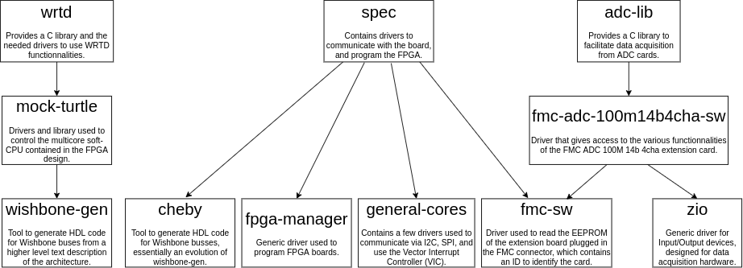

# Installing WRTD for the SPEC150T and FMC ADC

There are a lot lot of software dependencies needed for this project to work.
Here is a graph of most repositories that are used, and their dependencies:



Finding manually the right versions that are compatible with each other is out of question.
Until CERN provides a packaging with links to all the most up-to-date and compatible repositories, will be using the scripts provided by Dimitrios Lampridis to build and install everything:
https://gitlab.cern.ch/dlamprid/ohwr-build-scripts

## 1. Installing dependencies 

With `apt` for Debian:
```bash
sudo apt install linux-headers-amd64 build-essential gcc git patch sudo curl lua5.1 python-setuptools python-yaml python-decorator libreadline-dev
```
You may need to install `python-is-python3` so Python works properly when running the scripts later.

---

With `yum` for CentOS:

You will need CentOS Plus
```bash
sudo yum --enablerepo centosplus install kernel-plus kernel-plus-headers kernel-plus-devel
```
Reboot using CentOS Plus.
```bash
sudo yum install gcc git patch curl python-setuptools python-decorator python-yaml readline-devel
```

## 2. Running the scripts

Start by cloning the scripts:
```bash
git clone https://gitlab.cern.ch/dlamprid/ohwr-build-scripts.git
```

You will then need to patch the repository:
```bash
cd ohwr-build-scripts
patch -p 1 < ../ohwr-build-scripts-patch.patch
```

You should set the variable `BUILD_DIR` to a directory where all sources and built files will end up.

Finally, you just need to run the installation script and reboot:
```bash
cd scripts
sh wrtd_ref_spec150t_adc_install.sh
```
This should take roughly 5 minutes.

## 3. Flashing the FPGA

Afer each reboot, you will need to send the bitstream to the FPGA before you can do anything with the board.
To do so you can use the following command (`<PCI ID>` corresponds to the first column you should get when running `lspci | grep CERN`, looking like `XX:XX.X`; don't forget to escape the colon with a backslash):
```bash
echo -e -n "wrtd_ref_spec150t_adc.bin\0" > /sys/kernel/debug/0000\:<PCI ID>/fpga_firmware
```
The script `load_bitstream.sh` will run that command for you.

You may receive an error message saying `Failed to abort DMA transfer`. According to CERN, this does not cause any issue and the FPGA still receives the bitstream.

## 4. PCI class code issue

When installing everything on a Raspberry Pi CM4 (ARM processor), we get an error when the SPEC driver is loaded.

If you see a similar log in `dmesg`, read the following solution:
```
spec-fmc-carrier 0000:01:00.0 can't enable device: BAR 0 [mem 0x00000000-0x000fffff 64bit] not claimed
spec-fmc-carrier 0000:01:00.0 Failed to enable PCI device (-22)
spec-fmc-carrier probe of 0000:01:00.0 failed with error -22
```
This issue comes from the BIOS which in not handling properly the PCI class code `0x00`.
The solution proposed here consists in reprogramming the EEPROM containing the code and changing it to `0xFF`.

To do so, look into the `change_pci_class` directory.

If you want to explore other solutions, see this discussion:
https://forums.ohwr.org/t/spec-pci-class-code/848718

## 5. Intallation on a Rapberry Pi CM4 with Buildroot

The userspace tools provided by the project were implemented into Buildroot packages here:
https://github.com/oscimp/oscimp_br2_external.

However you will need to cross-compile the kernel modules and copy the relevent file onto your board manually for the time being.
Before executing the build scripts, provide the following environment variables:
```bash
export ARCH=arm64
export CROSS_COMPILE=<Buildroot directory>/output/host/bin/aarch64-linux-
export LINUX=<Buildroot directory>/output/build/linux-custom
export SKIP_INSTALL=yes
```
If you provide a `BUILDROOT` variable, you can just run `source cm4/build_settings.sh`.

After exporting these variables, you can execute the `wrtd_ref_spec150t_adc_install.sh` scripts which will build everything into `BUILD_DIR`.

Now you need to extract all the modules files (`.ko`) from the build directory and copy them to your board.
The script `extract_modules.sh` inside the `cm4` folder will copy all the relevent file into a `modules` folder, with the same folder structure as the normal installation would do.
After this is done, you can copy the content of the `modules` folder located inside `cm4` onto your CM4 board file system at `/lib/modules/<Linux version>`.
Finally you will need to activate the modules using the `insmod` command manually, or running the `activate_modules.sh` script on the CM4.
