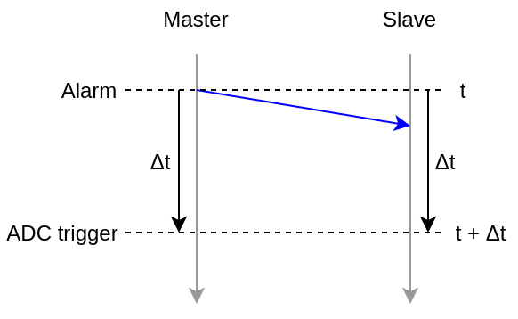

# How to use WRTD with the FMC ADC

We will be using the C libraries provided by the WRTD repository as well as the ADC-lib to interact with the SPEC board.

To facilitate basic compilation for a single source file, a Makefile was provided to automatically load the relevent libraries and include the headers.
Just run `make <your source file witout the file extension>` to generate an executable from a single source. For cross-compiling, the following environment
variables are expected:
```bash
export ARCH=arm64
export CROSS_COMPILE=<Buildroot directory>/output/host/bin/aarch64-linux-
export LINUX=<Buildroot directory>/output/build/linux-custom
```
in addition to the ``BUILD_DIR`` variable as described in section 5 of https://github.com/oscimp/WRTD-FMC-ADC/tree/main/wrtd_installation

## 1. Acquiring data without WRTD

The ADC has actually very few connections with WRTD.
In fact the only interaction the two have is a trigger.
Thus we can learn how to use the ADC before looking at WRTD.

To interact with the ADC, we will be using the adc-lib C library, which should be installed if you ran the installation scripts.

To use adc-lib, you have to include the following headers:
```c
#include <adc-lib.h>
#include <adc-lib-100m14b4cha.h>
```
You will also need to specify the path to these headers when compiling (`-I` option for gcc).
These are located inside your build directory at `$BUILD_DIR/adc-lib/lib`.
Finally you want to tell gcc to load the library using the `-ladc` option.
(The Makefile provided already has these options set)

The Documentation for adc-lib was provided in html format in this repository under `adc_lib_doc` to avoid having to build it from sources.
You can still build your own documentation from the official repository if you want: https://ohwr.org/project/adc-lib.

### ZIO device ID

To do an acquisition, it is required to know the ZIO device ID of the ADC card.
If the installation worked and the FPGA is programmed, this ID can be found in sysfs.
A folder named `adc-100m14b-XXXX` should be found at `/sys/bus/zio/devices`, where `XXXX` is the ZIO device ID in hexadecimal.

Running the script `zio_id.sh` should return this ID (printed in hexadecimal).

### Initializing the library

Before you use any function from adc-lib, you should call `adc_init` once. Similarly, `adc_exit` should be called before quitting your program.

The first thing to do after initialization is to get a structure for your device, which will be used by most functions from the library.
To do so we can call `adc_open`.

Its signature is the following:
```c
struct adc_dev *adc_open(char *name,
                         unsigned int dev_id,
                         unsigned long totalsamples
                         unsigned int nbuffer,
                         unsigned long flags)
```
In our case `name` will be `"fmc-adc-100m14b4cha"` and `dev_id` will be the ZIO device ID mentionned above.

Reading the documentation, we get that `totalsamples` is a hint to how big the buffer needs to be, this should be set to `NSHOTS * (PRESAMPLES + POSTSAMPLES)`.
`nbuffer` is a hint to how many buffers are to be used at the same time.
And `flags` can be set to `ADC_F_FLUSH`.

In the end our program should look like the following:
```c
int main()
{
	struct adc_dev *adc;

	adc_init();

	adc = adc_open("fmc_adc_100m14b4cha",
	               ZIO_ID,
                       NSHOTS * (PRESAMPLE + POSTSAMPLE),
	               NSHOTS,
                       ADC_F_FLUSH);

	// Configuring the ADC
	config(adc);
	// Acquiring data
	acquire(adc);

	adc_exit();
	return EXIT_SUCCESS;
}
```

### Error checking

adc-lib uses `errno` to track errors (from the `errno.h` header).
Thus we can check after each adc-lib function call if it went fine.

There is also a function to get a string from an error code: `adc_strerror`.

I like to write and use the following function, and call it after any adc-lib function call where I want to check for errors:
```c
static void adc_check_error(char *message)
{
	if (errno) {
		fprintf(stderr, "ADC-LIB ERROR: %s: %s", message, adc_strerror(errno));
		adc_exit();
		exit(errno);
	}
}
```

### Configuring the ADC

The first step before acquiring any data is to configure the ADC.
There are a lot of parameters that can be changed, which are documented in the adc-lib documentation.

- adc-lib sorts parameters in several categories such as "acquisition", "timing triggers" or "channels" for example. All categories are listed in the `adc_configuration_type` enumeration.
- When setting any parameter, we will have to fill a structure of type `struct adc_conf`.
- We first tell the category of parameters we want by setting the `.type` member.
- Then we can provide values for one or several parameters corresponding to the category using the function `adc_set_conf`. Parameters for each category are listed in an enumeration called `adc_configuration_<category>`.
- Finally we apply the changes with the function `adc_apply_config`.

Here is an example for setting the number of samples:
```c
// Initializing the configuration to default
struct adc_conf config;
memset(&config, 0, sizeof(struct adc_conf);

// Setting the category (acquisition in this case)
config.type = ADC_CONF_TYPE_ACQ;

// Setting a value for the number of samples to acquire after the trigger
adc_set_conf(&config, ADC_CONF_ACQ_POST_SAMP, 10);
// You can set several parameters at the same time as long as they fall in the same category
adc_set_conf(&config, ADC_CONF_ACQ_PRE_SAMP, 0);

// Applying the configuration (adc is your adc_dev struct pointer, 0 if a flag)
adc_apply_config(adc, 0, &config);
```

The most important parameters for our purposes are the number of samples to be acquired and the various triggers we would want to use.

### Acquiring data

To acquire data, we first need to allocate a buffer using `adc_request_buffer`.

The signature of the function is the following:
```c
struct adc_buffer *adc_request_buffer(struct adc_dev *adc,
                                      int nsamples,
                                      void *(*alloc_fn)(size_t),
                                      unsigned int flags)
```
`adc` will be our pointer to the ADC device. `nsamples` will be the total number of samples to acquire `NSHOTS * (PRESAMPLES + POSTSAMPLES)`. And we can leave the allocation function to default with `NULL` and set flags to `0`.

We will need to free the buffer once we are done with the acquisition using `adc_release_buffer`.

Then we can start the acquisition by calling `adc_acq_start`. The ADC will then wait for a trigger before acquiring samples.
It may be good practice to stop any pending acquisition before starting one by calling `adc_acq_stop`.

To fill your buffer with the acquired data, use `adc_fill_buffer`. If no trigger has happened before this function is called, it will wait until one happens, or until the specified timeout is passed.

Finally, here is an example of how an acquisition looks in code:
```c
// Allocating a buffer
struct adc_buffer *buffer;
buffer = adc_request_buffer(adc, NSHOTS * (PRESAMPLES + POSTSAMPLES), NULL, 0);

// Time struct to specify timeouts
struct timeval timeout = { .tv_sec = 0, tv_usec = 0 };

// Stopping any pending acquisition
adc_acq_stop(adc, 0);
// Starting a new acquisition immediately (timeout = 0)
adc_acq_start(adc, ADC_F_FLUSH, &timeout);

// Setting a 5s timeout for trigger waiting
timeout.tv_sec = 5;

for (int i = 0; i < NSHOTS; i++) {
	adc_fill_buffer(adc, buffer, ADC_F_FIXUP, &timeout);

	process_buffer(buffer);
}

// Freeing the buffer
adc_release_buffer(adc, buffer, NULL);
```

#### Software triggers

We can trigger manually a trigger in software, which is very handy for testing.
Normally we should be able to use `adc_trigger_fire` according to the documentation.
Unfortunately this function does not work so a workaround is needed.

My workaround was to manually write to a sysfs file using the following function:
```c
static void trigger_fire()
{
	int fd = open("/sys/bus/zio/devices/adc-100m14b-<ZIO ID>/cset0/trigger/sw-trg-fire", O_WRONLY);
	write(fd, "1", 1);
	close(fd);
}
```

#### Time triggers

It is possible to tell the ADC to trigger an acquisition at a certain date.
Note that this date comes from the ADC's internal clock, and this is not how the ADC should be configured for use with WRTD.
Nonetheless this can be useful for testing or other applications.
What WRTD uses is external triggers, which will be discussed later.

We only need to configure the time triggers with the API described earlier.
We can set a date in two parts: seconds and nanoseconds.
```c
// Initializing the configuration to default
struct adc_conf config;
memset(&config, 0, sizeof(struct adc_conf);

// Setting the category (time triggers in this case)
config.type = ADC_CONF_TYPE_TRG_TIM;

// Enabling time trigger
adc_set_conf(&config, ADC_CONF_TRG_TIM_ENABLE, 1);
// Setting seconds
adc_set_conf(&config, ADC_CONF_TRG_TIM_SECONDS, seconds);
// Setting nanoseconds
adc_set_conf(&config, ADC_CONF_TRG_TIM_NANO_SECONDS, nano_seconds);

// Applying the configuration
adc_apply_config(adc, 0, &config);
```

Generally you would want to retrieve the current time of the clock before you set up the trigger.
To do so you can read some variables from the current configuration using `adc_retrieve_config` and `adc_get_conf`.
The API provides 3 variables to get the current time in "seconds", "coarse sub-seconds", and "fine sub-seconds".
Since I generally just use time triggers for testing, I do not need nanosecond precision. Thus I just retrieve the seconds and increment it, and set the nanoseconds to 0.
```c
// Initializing the configuration to default
struct adc_conf config;
memset(&config, 0, sizeof(struct adc_conf);

// Setting the category (board in this case)
config.type = ADC_CONF_TYPE_BRD;

// Retrieving the current configuration
adc_set_conf_mask_all(&config, adc);
adc_retrieve_config(adc, &config);

// Getting the number of seconds
adc_get_conf(&config, ADC_CONF_UTC_TIMING_BASE_S, &seconds);

seconds += 1;
nano_seconds = 0;
```

`adc-time.c` is a test program which prints the time in seconds of the ADC clock.
It was used to test timing triggers with the `adc-acq` tool provided with adc-lib.
If you want to use it, make sure to modify the `ZIO_ID` macro to the correct value.
You can compile it by running `make adc-time`.

#### Processing data

To read from a buffer, use `adc_buffer_get_sample`:
```c
int adc_buffer_get_sample(struct adc_buffer *buf,
                          unsigned int chan,
                          unsigned int acq_sample,
                          int32_t *value)
```
`buf` is your buffer, `chan` is the channel number from 0 to 3 (corresponding to channels labelled from 1 to 4 on the board), `acq_sample` is the index of the sample to get from 0 to `PRESAMPLES + POSTSAMPLES - 1`, and `value` is a pointer to a variable where to write the sample.

Here is a simple function to write the content of a buffer to a CSV file:
```c
static void write_csv(struct adc_buffer *buffer, char *filename)
{
	int32 value1, value2, value3, value4;

	FILE *file = fopen(filename, "w");
	for (int i = 0; i < PRESAMPLE + POSTSAMPLE; i++) {
		adc_buffer_get_sample(buffer, 0, i, &value1);
		adc_buffer_get_sample(buffer, 1, i, &value2);
		adc_buffer_get_sample(buffer, 2, i, &value3);
		adc_buffer_get_sample(buffer, 3, i, &value4);

		fprintf("%i,%i,%i,%i,%i\n", i, value1, value2, value3, value4);
	}

	fclose(file);
}
```

`adc-test.c` will perform an acquisition and write the result to a file in CSV format.
I you want to try it out, edit the `ZIO_ID`, `SW_TRG` and `CSV_FILE` macros at the start of the file before compiling with `make adc-test`.

ADC-lib buffers also contain a timestamp for each shot (not for each sample).
That means we can get the time at which the trigger was received using `adc_tstamp_buffer`:
```c
struct adc_timestamp timestamp;
adc_tstamp_buffer(buffer, &timestamp);
```

This function fills up a `struct adc_timestamp` which contains 3 members: `.secs`, `.ticks` and `.bins`.
`.bins` seems to always be zero in our case, and we can extract nanoseconds from `.ticks` using a multiplication factor (I had to search in the source code to find that out...).
Here is a conversion function:
```c
static uint32_t adc_ticks_to_ns(uint32_t ticks)
{
	return ticks * FA100M14B4C_UTC_CLOCK_NS;
}
```
You need to include `fmc-adc-100m14b4cha.h` to use this constant, which also requires giving the option `-I$BUILD_DIR/fmc-adc-100m14b4cha-sw/kernel` to gcc when compiling (again already provided if you use the Makefile).

### Intel IOMMU issue

If the data you get is all zeros, you will need to disable a Linux boot parameter by adding `intel_iommu=off` in your `grub.cfg` file, or to whatever is used to boot your Linux distribution.

## 2. How to use WRTD

We will be using the C library provided by WRTD to interact with the SPEC board.
To do so we will need to include the following header:
```c
#include <libwrtd.h>
```
We also need to specify the relevent directories with `-I` when using gcc: `$BUILD_DIR/wrtd/software/lib` and `$BUILD_DIR/wrtd/software/include`.
The option `-lwrtd` also needs to be used.
(The script Makefile already has these options set)

The documentation for WRTD is available online at https://wrtd.readthedocs.io/en/latest

### Introduction

In this section I will attempt to explain concisely the WRTD concepts needed for use with the SPEC and ADC.

In our wanted setup, we have several SPEC boards connected through a White Rabbit network. The WR network and the FPGA design of the SPEC ensures that the clocks of all boards are synchronized.

In the WRTD language, each SPEC board will be called a "node". For each node we can define "rules", whose purposes are to associate an input event with an output event.

In our case, input events will be one of the two:
- The node receives a message from the WR network (which was sent by another node)
- The node receives a signal from the computer (in reality we can't really do that directly as we will see later, but it is easier to understand this way)

And output events will be one of the two:
- Send a message to the WR network
- Send a trigger to the ADC

This is basically all you need to know to understand the following.
In code we will essentially only configure rules, which just consist of telling which output event corresponds to which input event.

### Initialization

As for adc-lib, there are a few initialization steps to follow. First we need to get an ID for our node using `wrtd_get_node`. Then we can call `wrtd_init` to get a WRTD device struct, configure our rules, and finally call `wrtd_close`.

Here is a skeleton for a WRTD program:
```c
int main()
{
	struct wrtd_dev *wrtd;
	uint32_t node_id;

	// Get one node identifier
	wrtd_get_node_id(1, &node_id);
	// Initialize our device struct (the 2 middle arguments are not used)
	wrtd_init(node_id, false, NULL, &wrtd);

	config_rules(wrtd);

	wrtd_close(wrtd);
	return EXIT_SUCCESS;
}
```

### Error checking

The WRTD API also provides a way to check for errors.
Most functions will return a status value which can be checked against `WRTD_SUCCESS`.
The function `wrtd_error_message` can also be used to get a string for the error.

I like to write and use the following function:
```c
static void wrtd_check_status(wrtd_status status, int line)
{
	char status_str[256];
	if (status != WRTD_SUCCESS) {
		wrtd_error_message(NULL, status, status_str);
		fprintf(stderr, "WRTD ERROR: Line %i, %s\n", line,  status_str);
		exit(status);
	}
	errno = 0;
}
```

### Verifying White Rabbit synchronization

We can easily check if time is synchronized by reading a global attribute (more on attributes in the next paragraph).
```c
bool is_synced;
wrtd_get_attr_bool(wrtd, WRTD_GLOBAL_REP_CAP_ID, WRTD_ATTR_IS_TIME_SYNCHRONIZED, &is_synced);
if (is_synced)
	printf("WRTD is synchronized.\n");
else
	printf("WRTD is not synchronized.\n");
```

You can compile and use `wrtd-sync.c` to check if your board is properly connected to White Rabbit.
Run `make wrtd-sync` to generate the executable.

### Configuring a rule

Before declaring your first rule, I would suggest disabling and removing all existing rules in case there are any:
```c
wrtd_disable_all_rules(wrtd);
wrtd_remove_all_rules(wrtd);
```

Each rule will have an ID associated with it in the form of a string (in the documentation it may be refered as a repeated capability ID but I feel like it over complicates things).
In the same fashion, events also have a string to identidy them.
To configure a rule, we need to set the value for some parameters called "attributes" using functions from the `wrtd_set_attr_<type>` family.
We will be interested in setting a parameter for the input event, one for the output event, one for enabling the rule, and most likely one to add a delay (more on delays later).

Here is a typical rule declaration:
```c
// Create rule
wrtd_add_rule(wrtd, rule_id);

// Configure input event
wrtd_set_attr_string(wrtd, rule_id, WRTD_ATTR_RULE_SOURCE, input_event_id);

// Configure output event
wrtd_set_attr_string(wrtd, rule_id, WRTD_ATTR_RULE_DESTINATION, output_event_id);

// Configure delay to 500µs
struct wrtd_tstamp delay = { .seconds = 0, .ns = 500e3, .frac = 0 };
wrtd_set_attr_tstamp(wrtd, rule_id, WRTD_ATTR_RULE_DELAY, &delay);

// Enable rule
wrtd_set_attr_bool(wrtd, rule_id, WRTD_ATTR_RULE_ENABLED, true);
```

### Event IDs

As mentionned, events are identified by a string. Some strings are reserved for special events:
- `LC-I<x>` and `LC-O<x>` where x is an integer are reserved for local channels
- strings prefixed with `alarm` or `ALARM` are reserved... well for alarms which we will discuss later
- `LXI<x>`, `LAN<x>` and `LXIERROR` are reserved by the LXI protocol.

Any string that is not one of these will correspond to a "message", that is to say a packet sent through the White Rabbit network conveiving this ID.
If a node outputs an event with ID `foo`, then all other nodes will receive an input event with ID `foo`.

But then how do we trigger the ADC, and how do we generate an event from the computer if no IDs are made for that?

#### Triggering the ADC

This one is pretty simple: in the design for the SPEC and FMC ADC, the WRTD local channel 1 is mapped to the ADC's external trigger.
This means that the event ID `LC-O1` corresponds to the ADC trigger!

We also need to configure a few ADC parameters:
```c
// Initializing the configuration to default
struct adc_conf config;
memset(&config, 0, sizeof(struct adc_conf));

// Setting the category (external trigger in this case)
config.type = ADC_CONF_TYPE_TRG_EXT;

// Enable the external trigger
adc_set_conf(&config, ADC_CONF_TRG_EXT_ENABLE, true);
// Set the polarity
adc_set_conf(&config, ADC_CONF_TRG_EXT_POLARITY, ADC_TRG_POL_POS);
// No delay
adc_set_conf(&config, ADC_CONF_TRG_EXT_DELAY, 0);

// Applying the configuration
adc_apply_config(adc, 0, &config);
```

#### Creating an event from the computer

Unfortunately, there is not a direct way to generate an event from software. What we can do, is to use alarms.

The concept of an alarm is simple: you configure a date at which an event will be created, with an ID prefixed by `alarm` or `ALARM`.
You can also do more with alarms such as generating a periodic event.
However it must be noted that the SPEC150T design only allows for a single alarm.

We can first remove any existing alarm:
```c
wrtd_disable_all_alarms(wrtd);
wrtd_remove_all_alarms(wrtd);
```

Like for rules, we use attributes to configure what we need.
To define a date at which the alarm first triggers, we need to know the time of the WRTD clock.
Thankfully it can be easily read with a global attribute.
```c
// Create alarm
wrtd_add_alarm(wrtd, alarm_id);

// Structure used to define precise time values
struct tstamp time = { .seconds = 0, .ns = 0, .frac = 0 };

// Set period to 0 (the alarm triggers only once)
wrtd_set_attr_tstamp(wrtd, alarm_id, WRTD_ATTR_ALARM_PERIOD, &time);

// Reading the current time of the clock
wrtd_get_attr_tstamp(wrtd, WRTD_GLOBAL_REP_CAP_ID, WRTD_ATTR_SYS_TIME, &time);

// The alarm signal needs to be sent before it has to be processed by the receiver
// This tells to send the alarm in one second
time.seconds += 1;
wrtd_set_attr_tstamp(wrtd, alarm_id, WRTD_ATTR_ALARM_SETUP_TIME, &time);

// This is the time at which the rule receiving the alarm as its input event will need to process it.
// The node should receive the event before this date so transmission times do not interfere.
// (the delay between setup time and trigger time can be much less than a second)
time.seconds += 1;
wrtd_set_attr_tstamp(wrtd, alarm_id, WRTD_ATTR_ALARM_TIME, &time);

// Enable alarm
wrtd_set_attr_bool(wrtd, alarm_id, WRTD_ATTR_ALARM_ENABLE, true);
```

### Understanding delays

We know all nodes have synchronized clocks, thanks to the White Rabbit network and the SPEC FPGA design.
However, transmission and processing times may vary between events.
Thus the key to synchronized events is delay.

The solution is that every event contains a timestamp.
This way when a rule receives an event, it will wait until this timestamp is reached before sending the output event.

The output event will have the same timestamp as the input one, with the additional delay specified by the rule.
If no delay is set, there is no way that the output event can be processed in time by a receiving node as we have to account for transmission and processing times.

## 3. Examples

### Simple acquisition

The goal here is to reproduce the test acquisition described it part 1 and coded in `adc-test.c`, but instead of using a software trigger, we will use the external trigger that is mapped to a WRTD local channel.
This means we will still only be using one board and one computer for this experiment.

We create a rule that takes an input signal from the computer (which is actually an alarm as discussed earlier), and outputs into the ADC's external trigger.

The code for this example is provided in `wrtd-test.c`.
If you want to use it, modify the macros `ZIO_ID` and `CSV_FILE` at the beginning of the file before compiling using `make wrtd-test`.

### Master/Slave setup

In this example we have a master and one (or more) slave(s).
The master will first configure an alarm which will trigger at time _t_.
When the alarm triggers, the master will immediately send a message into the White Rabbit network with one rule with a timestamp of _t + Δt_, and wait for time _t + Δt_ before it triggers its own ADC with a second rule.
The slave will trigger its ADC once it receives the message, and the timestamp is reached.

Here is an image of the whole process:



The blue arrow represents the message sent by the master into the White Rabbit network.

The two programs `wrtd-master.c` and `wrtd_slave.c` will do exactly that.
To use them you first need to launch the slave program on your slave computer, which will wait for a trigger to happen.
Then you launch the master program on the master computer.
Both programs should terminate after a few seconds, and you should get a CSV file on each machine where you specified the location (`CSV_FILE` macro).
You can compile the programs by running `make wrtd-master` and `make wrtd-slave`.
